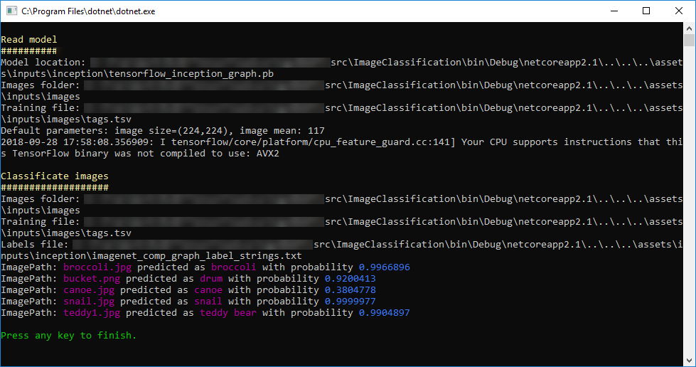

# Image Classification - Scoring sample

## Problem
Image classification is a common case in many business scenarios. For these cases, you can either use pre-trained models or train your own model to classify images specific to your custom domain. 

## Pre-trained model
There are multiple models are pre-trained for classifying images. In this case, we will use a model based on an Inception topology, and trained with images from Image.Net. This model can be downloaded from https://storage.googleapis.com/download.tensorflow.org/models/inception5h.zip, but it's also present at `/ src / ImageClassification / assets /inputs / inception / tensorflow_inception_graph.pb`.

##  Solution
The console application project `ImageClassification.Score` can be used to classify sample images based on the TensorFlow model. You need to follow next steps in order to execute the classification test:

1) **Set VS default startup project:** Set `ImageClassification.Score` as starting project in Visual Studio.
2)  **Run the training model console app:** Hit F5 in Visual Studio. At the end of the execution, the output will be similar to this screenshot:



##  Code Walkthrough
There is a single project in the solution named `ImageClassification.Score`, which is responsible for loading the model in TensorFlow format, and then classify images.

### ML.NET: Model Scoring
The `TextLoader.CreateReader()` is used to define the schema of the text file that will be used to load images in the training model. 
```csharp
var loader = TextLoader.CreateReader(env, 
    ctx => (ImagePath: ctx.LoadText(0), Label: ctx.LoadText(1)) );

var data = loader.Read(new MultiFileSource(dataLocation));
```

The image file used to load images has two columns: the first one is defined as `ImagePath` and the second one is the `Label` corresponding to the image. As you can observe, the file does not have a header row:
````csv
broccoli.jpg	broccoli
bucket.png	bucket
canoe.jpg	canoe
snail.jpg	snail
teddy1.jpg	teddy
```

The second step is to define the estimator pipe. Usually, when dealing with deep neural networks, you must adapt the images to the format expected by the network. This is the reason images are resized and then transformed (mainly, pixel values are normalized across all R,G,B channels).

```csharp
var estimator = loader.MakeNewEstimator()
    .Append(row => (
        row.Label,
        input: row.ImagePath
                    .LoadAsImage(imagesFolder)
                    .Resize(ImageNetSettings.imageHeight, ImageNetSettings.imageWidth)
                    .ExtractPixels(interleaveArgb: ImageNetSettings.channelsLast, offset: ImageNetSettings.mean)))
    .Append(row => (row.Label, softmax2: row.input.ApplyTensorFlowGraph(modelLocation)));
```
You also need to check the neural network, and check the names of the input / output nodes. In order to inspect the model, you can use tools like [Netron](https://github.com/lutzroeder/netron), which is automatically installed with [Visual Studio Tools for AI](https://visualstudio.microsoft.com/downloads/ai-tools-vs/). 
These names are used later in the definition of the estimation pipe: in the case of the inception network, the input tensor is named 'input' and the output is named 'softmax2'


Finally, we extract the prediction function after *fitting* the estimator pipeline. The prediction function receives as parameter an object of type `ImageNetData` (containing 2 properties: `ImagePath` and `Label`), and then returns and object of type `ImagePrediction`.  

```
var predictionFunction = estimator
  .Fit(data)
  .AsDynamic
  .MakePredictionFunction<ImageNetData, ImageNetPrediction>(env);
predictionFunctionPredict(sample).PredictedLabels;
```
When obtaining the prediction, we get an array of floats in the property `PredictedLabels`. Each position in the array is assigned to a label, so for example, if the model has 5 different labels, the array will be length = 5. Each position in the array represents the label's probability in that position; the sum of all array values (probabilities) is equal to one. Then, you need to select the biggest value (probability), and check which is the assigned label to that position.